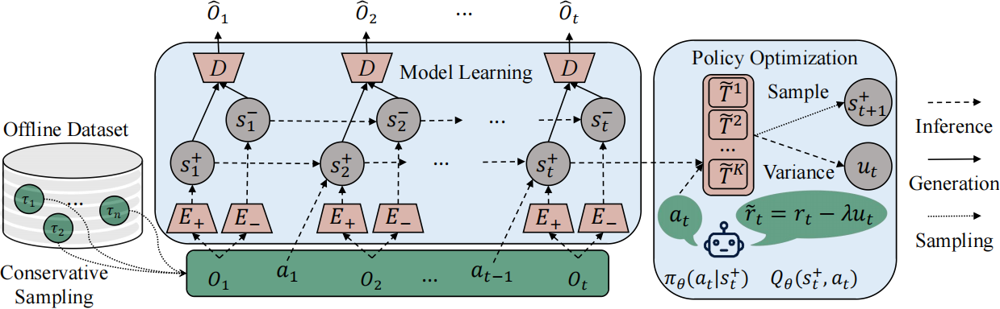

# SeMOPO: Separated Model-based Offline Policy Optimization

<p align="center">
  
</p>


## Benchmarks
The LQV-D4RL datasets can be found on [Google Drive](https://drive.google.com/drive/folders/1auuuVZaFB9UTO7i66S9EVJ5xULIbYdZG?usp=drive_link). **These must be downloaded before running the code.** Assuming the data is stored under `LQV-D4RL`, the file structure is:

```
├─cheetah_run
│  ├─medium
│  ├─medium_replay
│  └─random
├─hopper_hop
│  ├─medium
│  ├─medium_replay
│  └─random
└─walker_walk
    ├─medium
    ├─medium_replay
    └─random
```

A complete listing of the datasets is given in Table 3, Appendix C.

## Baselines

### Environment Setup
Requirements are presented in conda environment files named `conda_env.yml` within each folder. The command to create the environment is:
```
conda env create -f conda_env.yml

conda activate semopo
```


#### SeMOPO
```
MUJOCO_GL=egl CUDA_VISIBLE_DEVICES='0' python semopo/train_offline.py --configs dmc_vision --task dmcdrv_cheetah_run --offline_dir LQV-D4RL/cheetah_run/random --offline_penalty_type meandis --offline_lmbd_cons 10 --seed 0 --logdir ./logdir/semopoo --offline_datset_type random-incremental --video_dir envs/distracting_control/driving_car_16 --separate_wm True --disen_scales.reward 0.0 --disen_scales.disen_only 1.5 --grad_heads none --disen_action_type none --replay.incremental True --replay.sort_rewards True --steps 100000

MUJOCO_GL=egl CUDA_VISIBLE_DEVICES='0' python semopo/train_offline.py --configs dmc_vision --task dmcdrv_hopper_hop --offline_dir LQV-D4RL/hopper_hop/random --offline_penalty_type meandis --offline_lmbd_cons 10 --seed 0 --logdir ./logdir/semopo --offline_datset_type random-incremental --video_dir envs/distracting_control/driving_car_16 --separate_wm True --disen_scales.reward 0.0 --disen_scales.disen_only 2.0 --grad_heads none --disen_action_type none --replay.incremental True --replay.sort_rewards True --steps 100000
```


